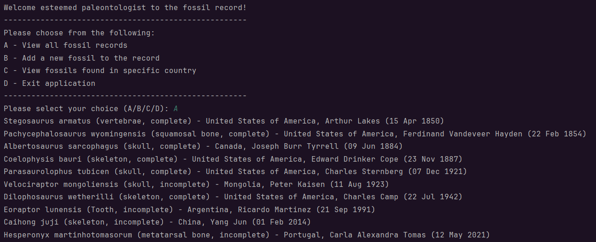
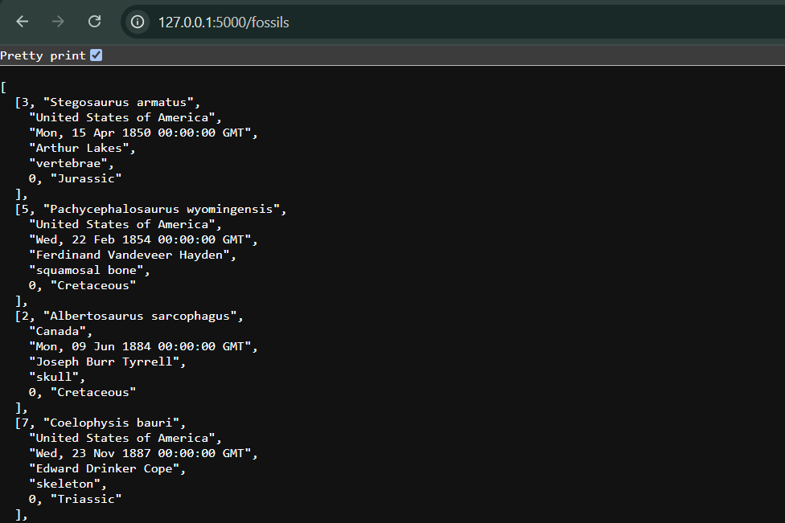
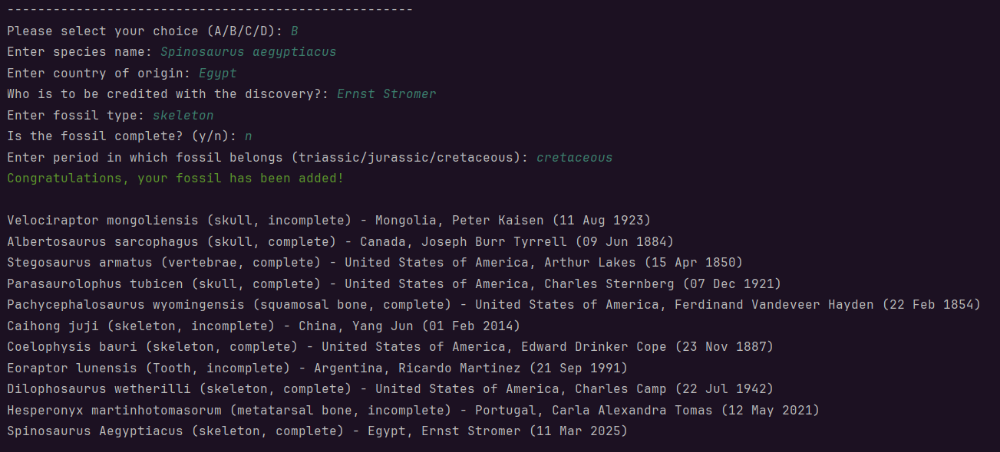
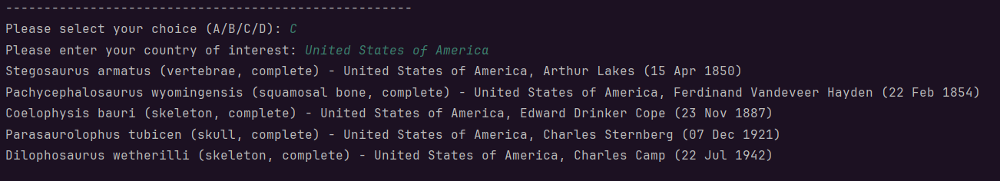
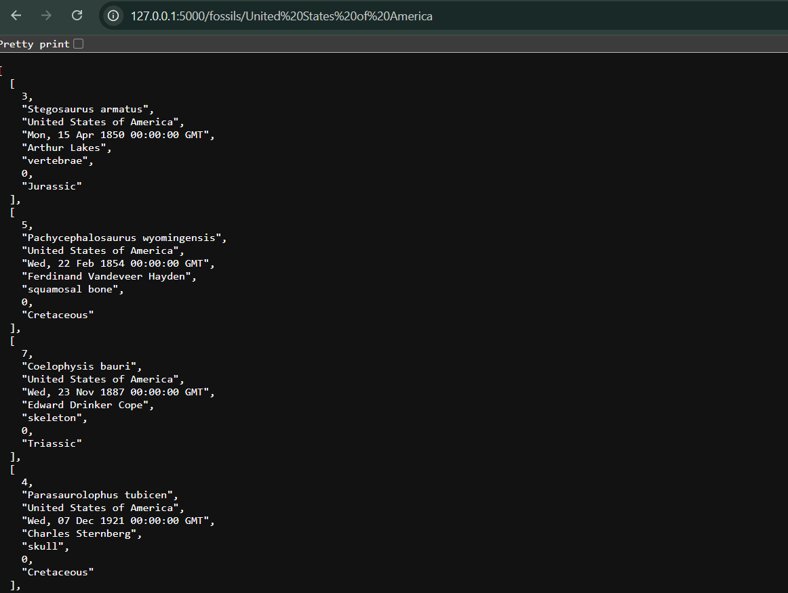

# Fossil Record API
___

This file instructs a user on how to operate the Fossil Record API.
The API is written using `Python`, `MySQL` for the database and `Flask` for the
server.

## Set Up
___

1. Ensure you have a `db_utils.py` file and a `config.py` file. This repo includes copies you can use and adapt
2. In the config file, set your database credentials. Feel free to use the template provided, replacing "<your-password-goes-here>" with your own password to your local machine
3. Run the provided SQL file to ensure your database is set up correctly.

## Running the Application
___

1. Begin by running the server. This means running the `fossil_api.py` file either via your terminal or using your desired IDE
2. Whilst the server is running, also run the application - your `main.py` file
3. To interact with the API, ensure you have your terminal open and follow the prompts on screen
4. Due to the use of a `while` loop, when you wish to end the application, you will need to select option D

## Available Endpoints
___

### /fossils GET
By selecting option A, or opening http://127.0.0.1:5000/fossils in a browser tab, you will find a list
of all the fossils currently contained in the database.

### /fossils/add POST
By selecting option B, you are able to follow the prompts and add a 
new fossil to the database. NOTE: Due to this being a POST method, you are
not able to view it in the browser as it requires parameters to be
passed to it

### /fossils/COUNTRYNAME GET
By selecting option C, or opening http://127.0.0.1:5000/fossils/<country_name> in 
a browser tab, you are able to view fossils found in the country chosen. NOTE:
When separating spaces in a country, e.g. United States of America, replace
every space with %20

